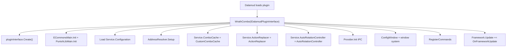
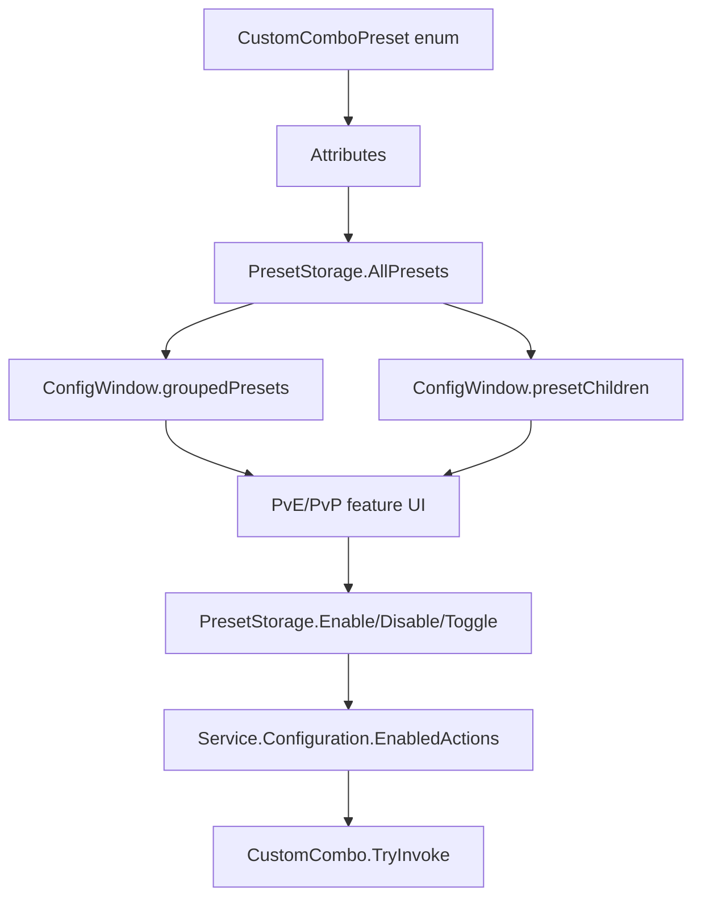
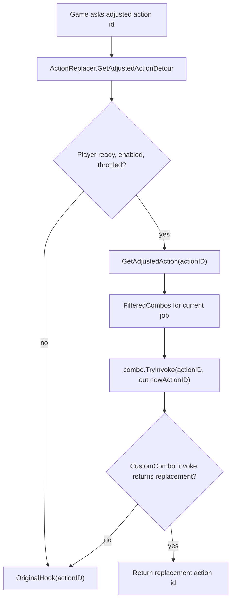
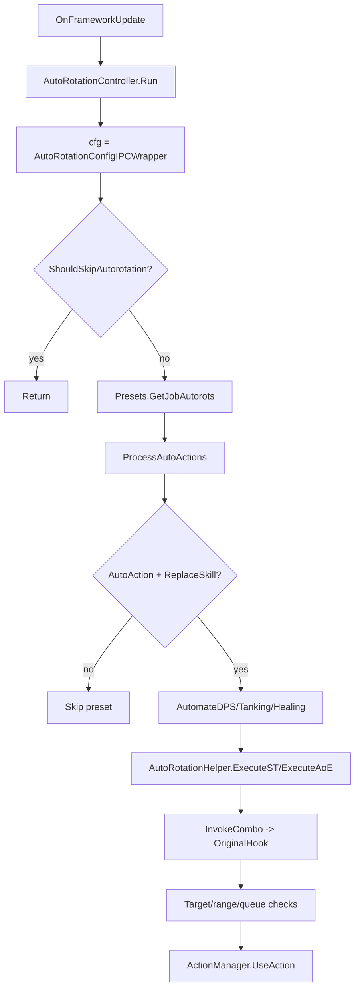
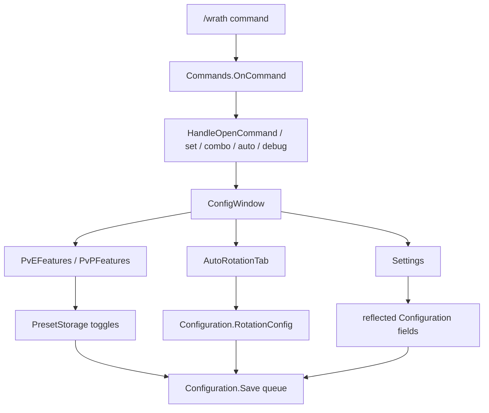

---
tags:
  - type/architecture-map
  - project/parselord5
  - status/active
type: architecture-map
project: parselord5
status: active
aliases: []
---
# ParseLord5 WrathCombo Architecture Map

Generated: 2026-05-17

ParseLord5 is currently a minimal WrathCombo fork. This map describes WrathCombo's existing architecture so future ParseLord5 work can add experiments without changing default behavior.

## Executive Map

- Base architecture: WrathCombo, not RSR.
- Main plugin entrypoint: `WrathCombo/WrathCombo.cs`.
- Manual combo replacement path: `ActionManager.GetAdjustedActionId` hook -> `ActionReplacer` -> enabled `CustomCombo`.
- PvE job logic: `WrathCombo/Combos/PvE/<JOB>/*`.
- Combo feature registry: `WrathCombo/Combos/CustomComboPreset.cs` plus attribute metadata.
- Auto-rotation path: framework tick -> `AutoRotationController.Run()` -> enabled auto-mode presets -> combo invocation -> `ActionManager.UseAction`.
- Config source of truth: `WrathCombo/Core/Configuration.cs`, saved by `ConfigurationHelper`.
- UI entrypoint: `/wrath` -> `Commands.cs` -> `ConfigWindow` tabs.
- Current ParseLord5 flag: `ParseLord5ExperimentalMode` is a default-false `Configuration` setting, surfaced through existing reflected Settings UI, and should only be checked inside future ParseLord5-specific job/debug code.

## Startup And Service Graph



Important ownership:

- `Service` is the static locator for `Configuration`, `ComboCache`, `ActionReplacer`, `AutoRotationController`, and address resolution.
- `WrathCombo.OnFrameworkUpdate` is the heartbeat for config saves, job cache updates, auto-rotation, DTR updates, and alert checks.
- `UpdateCaches` refreshes opener, retargeting, filtered combos, IPC caches, and active job presets on job or territory changes.

## Combo Feature System



Core pieces:

- `WrathCombo/Combos/CustomComboPreset.cs` declares preset IDs and metadata.
- Attribute metadata includes `JobInfo`, `ParentCombo`, `ConflictingCombos`, `ReplaceSkill`, `AutoAction`, retargeting attributes, and content markers.
- `PresetStorage.BuildPresets()` caches metadata into `AllPresets`.
- `ConfigWindow.GetGroupedPresets()` groups top-level presets by job for UI.
- `ConfigWindow.GetPresetChildren()` maps parent presets to child options.
- `Window/Functions/Presets.cs` draws feature toggles, auto-mode toggles, replace-skill indicators, retarget indicators, and nested child settings.
- Enabled feature state lives in `Configuration.EnabledActions`.
- Per-preset auto-mode state lives in `Configuration.AutoActions`.

Manual combo replacement flow:



Behavior-sensitive files:

- `WrathCombo/Core/ActionReplacer.cs`
- `WrathCombo/CustomCombo/CustomCombo.cs`
- `WrathCombo/Core/ConfigurationHelper.cs` for `ActionChanging` hook enable/disable

Do not change these in early ParseLord5 work except behind a very explicit plan.

## PvE Job Flow

PvE jobs follow a consistent pattern:

- Job folders live under `WrathCombo/Combos/PvE/<JOB>/`.
- Main job file usually defines nested `CustomCombo` classes, one per preset or feature.
- Config file usually defines `Config.Draw(Preset preset)` and per-job UI controls.
- Helper files hold action IDs, buffs, gauges, opener helpers, mitigation helpers, targeting helpers, or shared job math.
- Preset enum entries connect UI/config/action replacement to the job classes through shared preset IDs.

Warrior example:

- `WrathCombo/Combos/PvE/WAR/WAR.cs` contains nested classes such as `WAR_ST_Simple`, `WAR_AoE_Simple`, `WAR_ST_Advanced`, and standalone features.
- Each nested class extends `CustomCombo`, overrides `Preset`, and implements `Invoke(uint actionID)`.
- Combo classes first check whether the pressed action is their base button, then select replacement actions using helpers such as `TryUseMits`, `TryOGCDAttacks`, and `TryGCDAttacks`.
- `WAR_Config.cs` draws per-preset UI settings for selected Warrior features.

Why this matters for ParseLord5:

- Future tuning should happen inside one job folder at a time.
- The safest experimental edits are guarded inside a selected job's `Invoke` path after the preset has already passed WrathCombo's enable/job checks.
- Do not start by changing shared helpers or core replacement logic.

## Auto-Rotation Flow



Auto-rotation data sources:

- `Configuration.RotationConfig` stores enabled state and mode/settings.
- `AutoRotationConfigIPCWrapper` overlays IPC-controlled values where present.
- `Presets.GetJobAutorots` filters `IPCSearch.AutoActions` to current job, current PvE/PvP state, enabled presets, top-level presets, and auto-mode enabled presets.
- `AutoRotationController.ProcessAutoActions` filters to presets with both `AutoAction` and `ReplaceSkill` metadata.
- `AutoRotationHelper.InvokeCombo` chooses a base `ReplaceSkill` action, invokes the combo, then routes through original action replacement before execution.

Behavior-sensitive execution points:

- `ActionManager.Instance()->UseAction(...)` calls in `AutoRotationController.cs`.
- `ExecuteST`, `ExecuteAoE`, `ProcessAutoActions`, `InvokeCombo`.
- Queue, range, target, movement, `ActionChanging`, and `OriginalHook` interactions.

Early ParseLord5 work should map and trace these paths, not alter them.

## Config, Settings, Commands, And UI



Command entrypoints:

- `/wrath` and `/scombo` are registered in `Commands.RegisterCommands`.
- `OnCommand` dispatches to feature toggles, combo settings, auto-rotation commands, debug commands, and window opening.
- `/wrath auto` toggles `Configuration.RotationConfig.Enabled`.
- `/wrath auto target <damage|healer> <mode>` changes target mode settings.

UI entrypoints:

- `ConfigWindow` owns sidebar and body routing.
- Main tabs: PvE, PvP, Settings, AutoRotation, About, Debug.
- `PvEFeatures` and `PvPFeatures` draw grouped presets.
- `AutoRotationTab` edits `Configuration.RotationConfig`.
- `Settings` reflects fields on `Configuration` with `Setting` attributes and draws generic controls.

Save path:

- Most UI and command changes call `Service.Configuration.Save()`.
- `Save()` queues config writes.
- `WrathCombo.OnFrameworkUpdate` calls `Configuration.ProcessSaveQueue()`.
- `ProcessSaveQueue()` writes through `Svc.PluginInterface.SavePluginConfig(config)`.

## Safest Experimental Mode Plan

Current flag:

```csharp
[SettingCategory(Main_UI_Options)]
[Setting(Setting.Type.Toggle)]
public bool ParseLord5ExperimentalMode = false;
```

Current placement:

- Lives in `WrathCombo/Core/Configuration.cs` near UI settings.
- Existing `Window/Tabs/Settings.cs` reflected settings UI draws it.
- Keep default `false`.
- Do not wire it into action replacement, auto-rotation, hooks, commands, or job behavior in the flag-only commit.

Recommended first use after flag exists:

- In one selected job folder, likely `WAR` first, wrap ParseLord5-only tuning with:

```csharp
if (Service.Configuration.ParseLord5ExperimentalMode)
{
    // ParseLord5-only experiment for one selected preset.
}
```

**Status (2026-05-17):** The first WAR experiment has been executed. `WAR_ST_Simple` now swaps GCD/oGCD priority when the flag is enabled. See `docs/ParseLord5_Gameplay_Experiment_WAR_20260517.md`.

Why this location is safest:

- `Configuration` already persists plugin settings.
- `Settings` already reflects attributed config fields, so no bespoke UI is needed.
- Job-level checks avoid broad impact to every job.
- Default `false` preserves all existing WrathCombo behavior.
- The flag can later guard debug tracing without touching `UseAction`, hooks, detours, or shared replacement logic.

Do not put the first flag gate in:

- `ActionReplacer.GetAdjustedActionDetour`
- `ActionReplacer.GetAdjustedAction`
- `AutoRotationController.Run`
- `AutoRotationHelper.ExecuteST` or `ExecuteAoE`
- `ActionManager.UseAction` call sites
- command dispatch

Those locations are too broad for first-pass experiments.

## ParseLord5 Next-Step Sequence

1. Confirm default-false `ParseLord5ExperimentalMode` remains behavior-neutral.
2. Add debug tracing behind flag for one selected job.
3. Choose first job: Warrior for learning the fork, Dragoon for comparing previous ParseLord work.
4. Tune one selected preset in one job with flag on.
5. Keep `/wrath` and existing WrathCombo behavior unchanged until a separate command migration plan exists.

## Risk Register

- `/wrath` command conflict remains if regular WrathCombo and ParseLord5 load together.
- Namespaces still say `WrathCombo`; this is acceptable for early fork safety but affects stack traces/logs.
- Auto-rotation uses live `UseAction`; tracing must avoid changing queue/target/range behavior.
- `ActionChanging` toggles hook enablement; broad changes there can break all combo replacement.
- IPC uses `WrathCombo` prefix; changing it needs a separate compatibility plan.
- Existing upstream docs lack vault metadata; ParseLord5 docs should include metadata, upstream docs can remain untouched unless deliberately normalized later.
